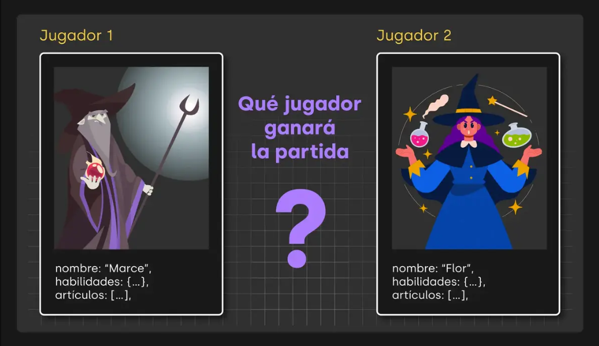

A luchar solo javascript.

---

El objetivo
En este juego tenemos dos personajes que se van a enfrentar. Cada personaje posee una serie de habilidades y características.

El objetivo de tu aplicación es evaluar el resultado de una pelea hipotética entre ambos; es decir, tu programa deberá indicar qué jugador gana el juego.

---

---

Puntos por habilidad
La primera parte del desafío consta en completar todas las comparaciones necesarias para establecer qué jugador es mejor en cada habilidad.
Quien tenga la mejor habilidad en cada caso sumará 1 punto en su contador.
En caso de empate, ambos suman 1 punto.
Por ejemplo
Si el jugador 1 tiene 10 puntos de ataque y el jugador 2 tiene 20 puntos de ataque, el jugador 2 sumará un punto en su contador.
Cada habilidad del jugador 1 (objeto) deberá compararse con la misma habilidad del jugador 2 (otro objeto).
Es importante contemplar qué sucede en caso de empate.

---

Punto por cantidad de artículos
La segunda misión del desafío es determinar qué jugador suma un punto extra por tener la mayor cantidad de artículos.
Para lograrlo deberás buscar una forma de comparar la cantidad de artículos que cada jugador posee, y asignarle el punto extra a quién corresponda.

---

Ganador
Finalmente debes escribir el código necesario para determinar quién es el ganador. Para hacerlo deberás generar un nuevo objeto que muestre los siguientes resultados:
Los puntos obtenidos por el jugador nro 1
Los puntos obtenidos por el jugador nro 2
El nombre del ganador

---

Empate
En caso de que haya un empate asignale a la propiedad ganador el texto "empate".

---

Pruebas
Te invitamos a que resuelvas tu desafío con los datos iniciales del código base y luego alteres los valores de los jugadores para probar distintos escenarios. Recordá utilizar console.log() siempre que necesites entender que pasa dentro de cualquier dato o bloque de código.
